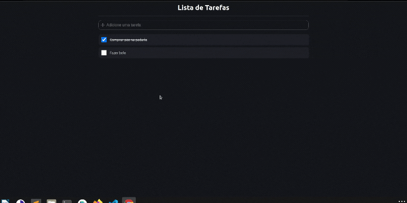

<h1 align="center"> React JS - ToDO List</h1>

#Índice
- [Demo](#demo)
- [🛠 Sobre o projeto](#-sobre-o-projeto)
- [🚀 Tecnologias utilizadas neste projeto](#-tecnologias-utilizadas-neste-projeto)
- [📥 Como usar](#-como-usar)
- [🚀 Autor](#-autor)
  

# Demo
<p align="center">
 
</p>

---
# 🛠 Sobre o projeto

<p>Este projeto foi desenvolvido para treinar as habilidades de React JS, juntamente com as lives do Bonieky.</p>


# 🚀 Tecnologias utilizadas neste projeto

- [x] JAVASCRIPT
- [x] REACT JS
- [x] TYPESCRIPT
- [x] STYLED-COMPONENTS
- [x] COMPONENTS

# 📥 Como usar
```js

    //Clonar o repositório
    $ git clone https://github.com/TayseRosa/ReactJs-ToDo.git

    //Entrar no diretório
    $ cd ReactJs-ToDo

    //Instalar bilbiotecas
    $ npm install

    //Startar o projeto
    $ npm start

``` 

# 🚀 Autor

<a href="https://www.tayserosa.dev">
 
 <br />
 <sub><b>www.tayserosa.dev</b></sub></a> <a href="https://www.tayserosa.dev" title="Tayse Rosa" target="_blank">🚀</a>


Feito com ❤️ por Tayse Rosa 🚀

👋🏽 Entre em contato!

[](https://github.com/TayseRosa/)[](https://app.netlify.com/sites/tayserosa-todo-reactjs/deploys)
